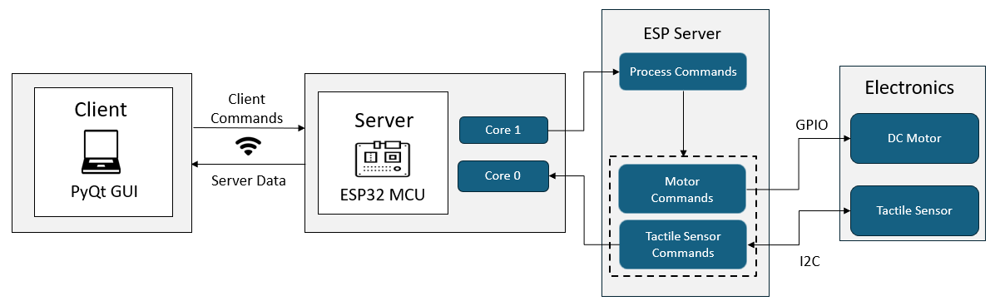

# Queen Mary University of London
## MSc Advanced Robotics
### Soft Robotic Gripper - ESP32 Server

## Overview
The soft robotic gripper contains an ESP32 MCU that is responsible for its actuation and reading tactile data from the Hall Effect sensors attached to the tips of the fingers. It can receive wireless commands using the [Graphical User Interface](https://github.com/gpoell/qmul-rbh-gui) designed to simplify the collection and visualization of tactile data. 

This application is developed using [PlatformIO](https://docs.platformio.org/en/latest/what-is-platformio.html) which enables the use of the Arduino framework and the C++ STL to provide a development environment familiar to most students. The ESP32 contains 2 cores that allow for processes to run concurrently; one process actively listens for commands from the GUI to operate the motor while the other process continuously sends real-time tactile data to the GUI.  

## Table of Contents
1. [Project Background](#project-background)
1. [Installation and Dependencies](#installation-and-dependencies)
2. [Running the Application](#running-the-application)
3. [Application Architecture](#application-architecture)
4. [Repository Folder Structure](#repository-folder-structure)
5. [Helpful Articles](#helpful-articles)

## Project Background
My dissertation is focused on classifying strawberry ripeness using the tactile data from the soft robotic gripper. The goal is to develop a technique that emulates how we use our sense of touch to assess the quality of certain crops, like picking ripe avacados at a supermarket. Computer vision is a popular and efficient technique for assessing crop ripeness, especially now that modern cameras can see better than humans. However, not all crops show obvious signs of differentiable ripeness levels, and problems with computer vision still persist in occluded harvesting environments where cameras struggle to see through shadows or branches, which is still an issue while harvesting strawberries. Providing a simple technique using tactile data to reinforce what the camera sees with what the gripper feels could prove useful when harvesting in occluded environments and performing post harvest quality inspections.

## Installation and Dependencies
[Visual Studio Code](https://code.visualstudio.com/) is a powerful, lightweight editor that provides extensions for a variety of programming languages and frameworks. There is a [PlatformIO extension](https://docs.platformio.org/en/latest/integration/ide/vscode.html) that can easily be installed to use with VS Code.

## Running the Application
Below are instructions to clone the repository using SSH and running the application.

<details>
<summary>Cloning the repository with SSH</summary>

1. Install the latest version of [Git.](https://git-scm.com/downloads)
2. Connect to your GitHub account with SSH: [Connecting to GitHub with SSH](https://docs.github.com/en/authentication/connecting-to-github-with-ssh "Connecting to GitHub with SSH"). Specifically use the instructions below
    1. <https://docs.github.com/en/authentication/connecting-to-github-with-ssh/generating-a-new-ssh-key-and-adding-it-to-the-ssh-agent>
    2. <https://docs.github.com/en/authentication/connecting-to-github-with-ssh/adding-a-new-ssh-key-to-your-github-account>
3. Create a directory called PlatformIO. PlatformIO requires this folder to detect the workspace.
4. Clone the repository under the PlatformIO directory:
```
git clone git@github.com:gpoell/qmul-rbh-esp32.git
```
</details>

<details>
<summary>Running the application</summary>

Open the repository with VS Code once PlatformIO is installed. PlatformIO should automatically detect the platformio.ini file at the root level of the repository and configure your PlatformIO workspace. PlatformIO provides similar features to Arduino and follows the same process of building, uploading, and opening the Serial Monitor. I would recommend starting with the [PlatformIO Quick Start](https://docs.platformio.org/en/latest/integration/ide/vscode.html) example to ensure everything is configured correctly.

1. Build the workspace
2. Upload the executable to the ESP32
3. Open the Serial Monitor

<b>Note:</b>  
The Wi-Fi connection details are automatically read from a header file called secrets.h inside of the includes/ directory. This file should contain your connection details in the following format:  
<b>secrets.h</b>

```
#ifndef secrets_h
#define secrets_h

struct wifi_creds {
    const char ssid[5] = "SSID";
    const char passwd[8] = "password";
};

#endif
```
</details>

## Application Architecture
The ESP32 contains a dual-core processor that is used to run two processes concurrently. The main process runs on Core 1 which actively listens for incoming client connections from the GUI. The commands sent from the GUI are passed to the [ESPServer](include/ESPServer.h) which serves as a gateway for executing tactile and motor functions. In addition to processing client commands, Core 1 executes motor related functions and returns back to listening for new client connections. Core 0 is responsible for continuously communicating tactile data to the GUI once it has detected the connection flag in the ESPServer is enabled. 

<b>ESP32 Server Architecture Diagram</b>
<picture>
    
</pictuer>

<details>
<summary>Arduino Wi-Fi</summary>

The [Arduino Wi-Fi](https://www.arduino.cc/reference/en/libraries/wifi/) libraries are used to create the server running on the ESP32. During setup, the [ESPServer](include/ESPServer.h) is initialized which sets the IP configuration, connects to the network defined in secrets.h, and starts the [server](https://www.arduino.cc/reference/en/libraries/wifi/server.begin). Core1 actively listens and processes incoming [WiFiClient](https://www.arduino.cc/reference/en/libraries/wifi/wificlient) connections. Data is sent back to the GUI through the [client.print()](https://www.arduino.cc/reference/en/libraries/wifi/client.print) method.
</details>

<details>
<summary>Tactile Sensor</summary>

The [Tactile Sensor](include/TactileSensor.h) is composed of 4 [MLX90393](include/MLX90393.h) Hall Effect sensors that record magnetic flux density measurements in 3 dimensions. Each Hall Effect sensor has a magnet suspended slightly above it in a soft silicon material which create larger magnetic flux readings as they are pressed towards the sensors. These recordings are captured using I2C and the Arduino Wire library. The memory addresses containing the 3 dimensional recordings of for the Hall Effect sensors are found in its [datasheet](docs/MLX90393-Datasheet-Melexis.PDF). 
</details>

<details>
<summary>L9110H Motor</summary>

The actuator for the soft robotic gripper is a [RS PRO Brushed Geared DC Geared Motor](https://my.rs-online.com/web/p/dc-motors/4130600) connected to a [L9110H H-Bridge Motor Driver](https://www.adafruit.com/product/4489). The motor terminals can be connected to the ESP32 GPIO pins 18 and 19 where the direction of the motor is controlled by supplying power to one of the pins using Arduino's digitalWrite method. The [L9110H Motor](include/L9110HMotor.h) is a simple module containing methods for initializing the pins, and opening and closing the gripper.
</details>

## Repository Folder Structure
📁docs/         -- documents for the README  
📁include/      -- project header files  
📁lib/          -- project specific libraries  
📁src/          -- source code  
📁test/         -- project tests

## Helpful Articles
<b>Wi-Fi</b>  

[Arduino Wi-Fi](https://www.arduino.cc/reference/en/libraries/wifi/)
[ESP32 Useful Wi-Fi Library Functions](https://randomnerdtutorials.com/esp32-useful-wi-fi-functions-arduino/)

<b>PlatformIO</b>  

[PlatformIO extension](https://docs.platformio.org/en/latest/integration/ide/vscode.html)

<b>DC-Motor: Arduino</b>  

[Arduino DC-Motor](https://arduinogetstarted.com/tutorials/arduino-dc-motor?utm_content=cmp-true)